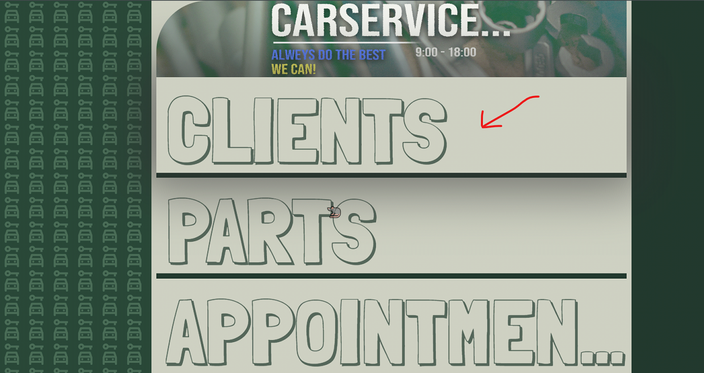
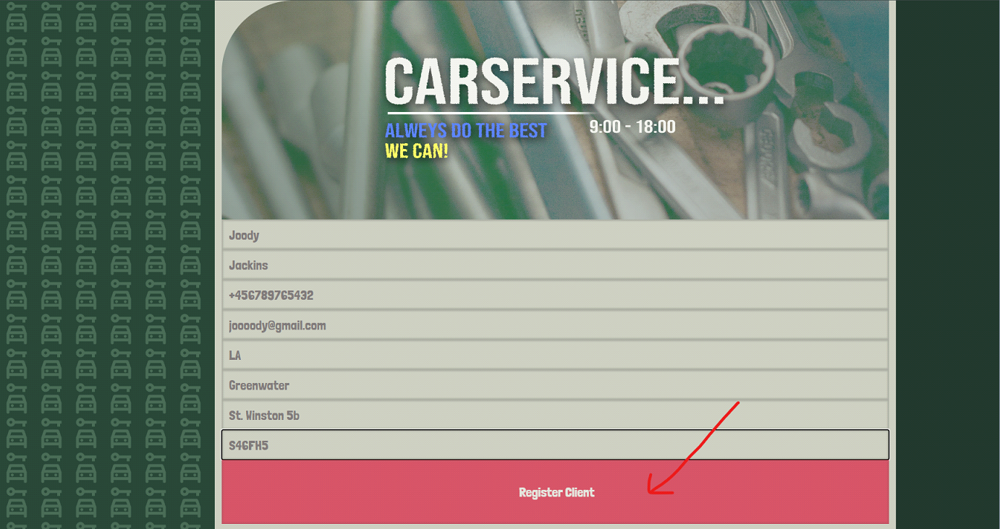
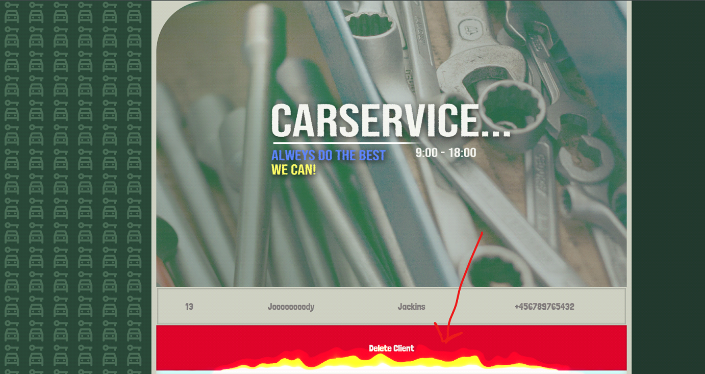
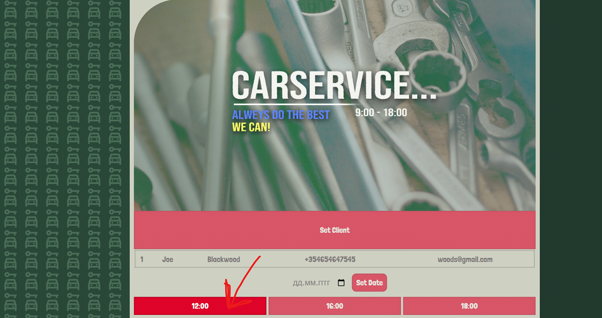
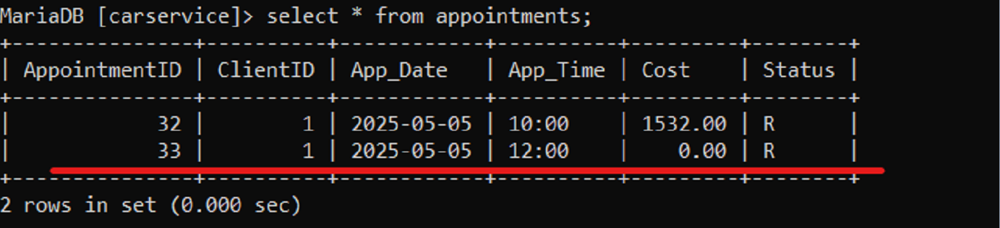
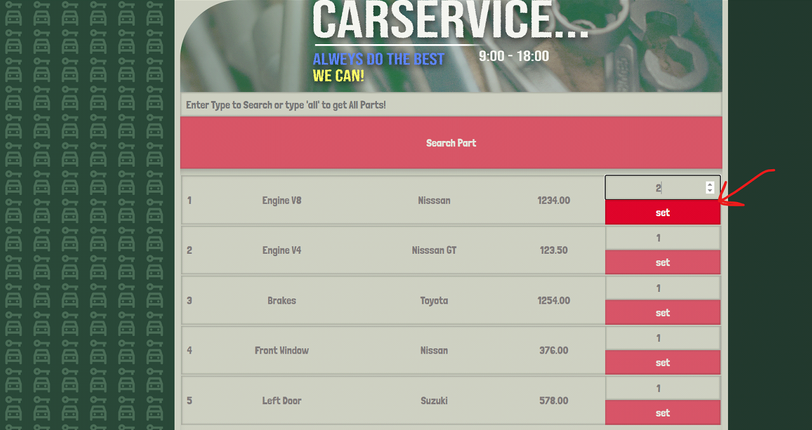
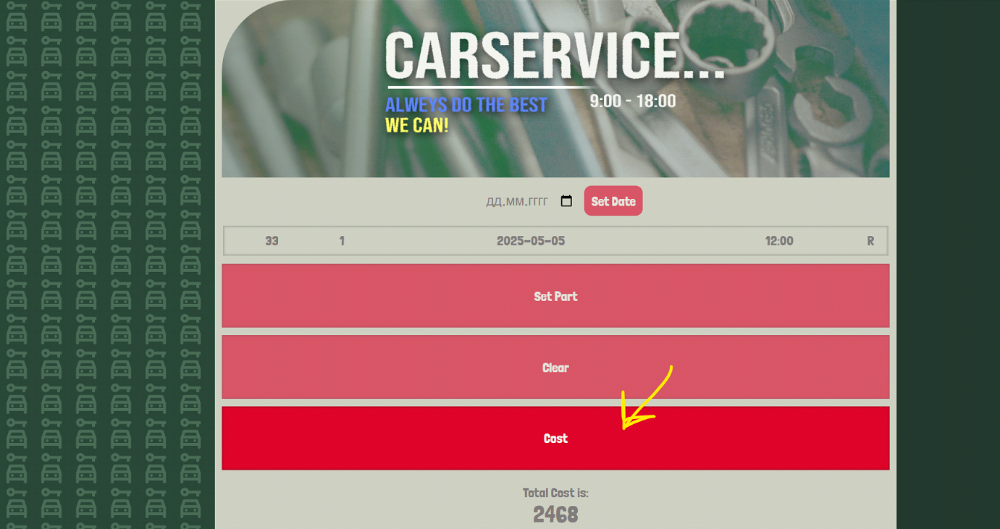
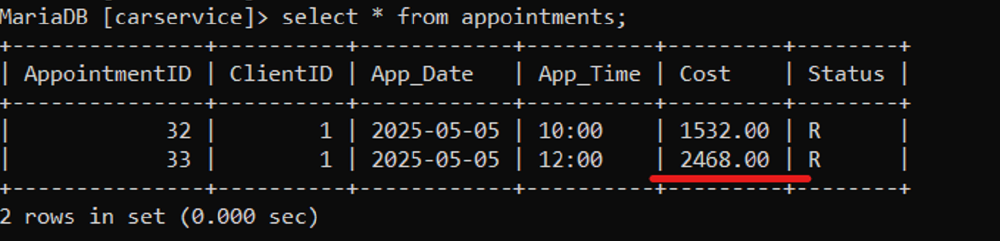

# 🛠 CarService-Sys-php


> CarService is a system for managing and automating auto mechanic service processes. Using the system you can create, update and delete clients. Add, update and delete part. And also, if there are clients and parts in the system, you can create an appointment for the customer for the scheduled free time. Delete the created appointment if necessary, and calculate the cost based on the used parts.

> **The project is part of a university project and has been created for educational purposes only.**

---

| Feature                    | Description                                                        |
| -------------------------- | ------------------------------------------------------------------ |
| 👤 Client Management       | Create, update, and delete client records                          |
| 🧩 Parts Management        | Add, update, and remove parts used in repairs                      |
| 📅 Appointment Scheduling  | Schedule appointments based on available time slots                |
| ❌ Appointment Cancellation | Cancel existing appointments when necessary                        |
| 💰 Cost Calculation        | Automatically calculate total service cost based on selected parts |
| 🔄 Workflow Automation     | Simplifies daily operations for auto mechanic services             |
| 🔗 Entity Integration      | Coordinates clients, parts, and appointments into a unified system |

---

## 📸 Screenshots

| Main Screen |
|:--------:|
|  |

| Main Screen - Reg Client |
|:--------:|
|  |

| Reg Client - Add |
|:--------:|
|  |

| Delete Client |
|:--------:|
|  |

| Create Appointment |
|:--------:|
|  |

| Create Appointment - DB check|
|:--------:|
|  |


| Set Parts for Cost |
|:--------:|
|  |

| Cost Appointment |
|:--------:|
|  |

| Cost Appointment - DB check|
|:--------:|
|  |

---

### ⬇️ Installation

```bash
git clone https://github.com/Albert-Tr-pp/CarService-Sys-php.git
cd CarService-Sys-php/carservice-sys-site-php

start index.php
```

---

## 📁 Project Structure

```
Quiz-Game_js/
├── carservice-sys-site-php/
│   ├── Add-Up_Part/...
│   ├── Cost_Service/...
│   ├── Create_App/...
│   ├── img/...
│   ├── Record_Payment/...
│   ├── Reg-Up_Client/...
│   ├── Remove_App/...
│   ├── Up-Del_Client/...
│   ├── Up-Del_Part/...
│   ├── fire.css
│   ├── index.php
│   └── pdo_conn.php
├── db/
│   ├── carservice.sql
│   └── Server_Side_DB_BackUp.txt
├── screenshots/...
├── .gitignore
├── LICENCE
└── README.md
```

---

## ⚠️ License Notice

MIT License

Copyright (c) 2025 Albert Tromsa

---

## 📬 Contact

Feel free to reach out for questions or suggestions:

- Gmail: [tromsaalbert@gmail.com](mailto:tromsaalbert@gmail.com)
- GitHub: [github.com/Albert-Tr-pp](https://github.com/Albert-Tr-pp)

---

> 🧪 Keep learning by building! This project is a great foundation to explore Godot and game development.